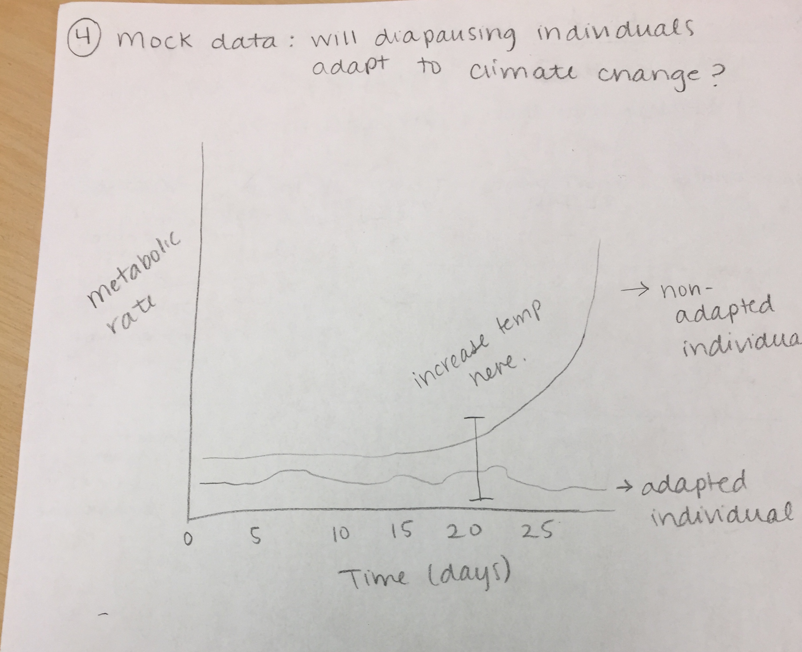

####Here I used four methods/tools for visualizing the ideas and hypotheses for my research on the ecological physiology of overwintering strategies in butterflies. My main research question is:  **How do temperature and seasonal anomalies affect butterflies' overwintering physiological processes?**

1. **Path analysis:** This path analysis shows the potential interaction between envrionmental and molecular factors that stimulate diapause in *Pieris rapae* butterflies. These factors include photoperiod, temperature, and hormone and protein levels.  

2. **Logic tree:** This logic tree shows the potential cascading effects different degrees of winter warming (short term extremes vs. long-term consistent warming) have on various physiological processes that are important for diapause performance (metabolic rate and developmental timing). Such effects could indicate instances of adaptation (survival under winter warming) or physiological costs (death under winter warming).    

3. **Look-up table:** This look-up table shows if there is a relationship between temperature (constant vs. variable) and photoperiod (long vs. short). However, I don't believe this is the right tool for this particular question/set-up. Instead of having separate tests like Nick demonstrated in class, I used different variable and whether diapause was observerd under them. In this case, I don't think this table was the right approach. 

   
   
4. **Mock data** Here I used a hypothetical graph to show was some potential results could be for my winter warming experiment. One line shows an individual who did not adapt under winter warming (increased metabolic rate at time of warming) and one that did (consistently low m.r. at time of warming). Such data would be interesting because it would suggest plasticity of certain traits for individuals, maybe even from different populations... 

