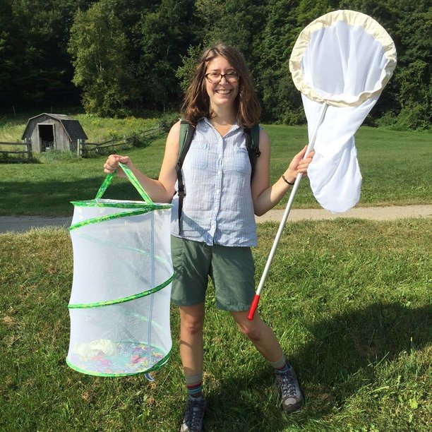

###About Me
I am a second-year PhD student in Biology studying the physiological consequences of increased warming in diapausing *Pieris rapae* butterflies. I am co-advised by Dr. Brent Lockwood and Dr. Alison Brody. 

[UVM Biology Graduate Student Page](http://www.uvm.edu/~biology/?Page=students/mikucki.php&SM=facultysubmenu.html)

## Computational Biology - Spring 2017

##Assignments:

* [Assignment 1](sloth_attack.jpg)       
* [Assignment 2 ](Homework02_Hypothesis_Tools.html)
* **Assignment 3**
    + [Hypotheses Flowchart (don't forget to slide!)](Hypotheses_Flowchat.html)   
    + [Original Powerpoint](Beamer_Slides_02012017_Original.pdf)   
    + [Beamer Slides (.Rmd)](Beamer_Slides_02012017.Rmd)   
    + [Beamer Slides (PDF)](Beamer_Slides_02012017.pdf)
    
##Notes:

####Lecture
* [January 17, 2017: Course Introduction](Lecture_Notes_01172017.html)   
* [January 24, 2017: Working with RStudio](Lecture_Notes_01242017.html)
* [January 26, 2017: Working with RStudio Cont.](Lecture_Notes_01262017.html)
* [January 31, 2017: Typora and Beamer Slides](Lecture_Notes_01312017.html)

#### Lab
* [January 18, 2017: Creating a Repository](Lab_Notes_01182017.html)

## Demos:
* [January 24, 2017: RMarkdown Demo (Updated 01/26/2017)](Markdown_Demo.html)
* [January 26, 2017: First R Script](First_Script.html)
* [January 31, 2017: Typora Demo](Typora_Demo_01312017.pdf)
* [January 31, 2017: Beamer Slides Demo](Beamer_Demo.pdf)

